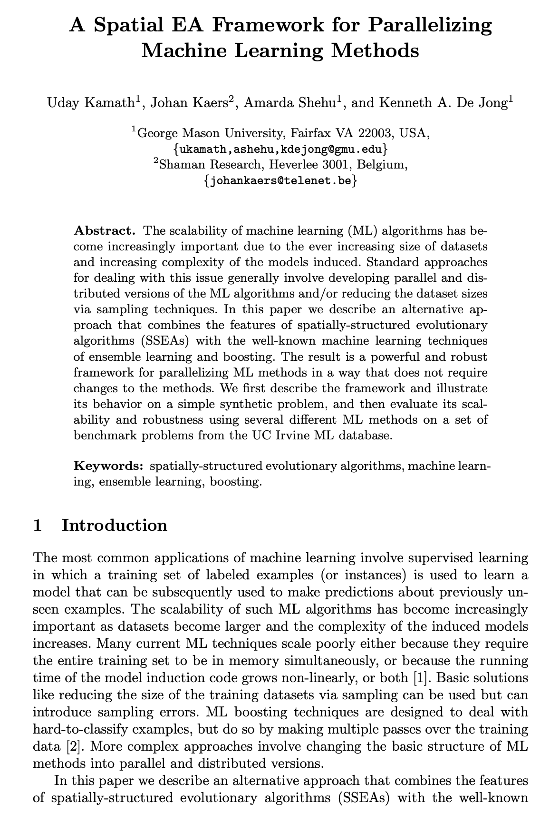
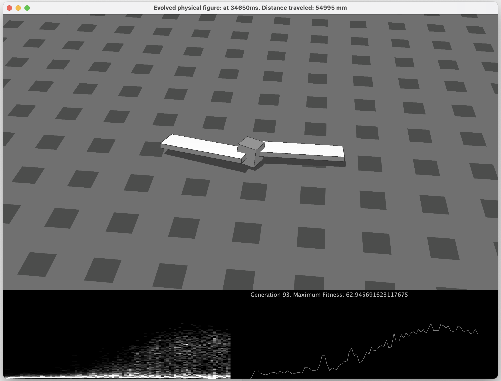
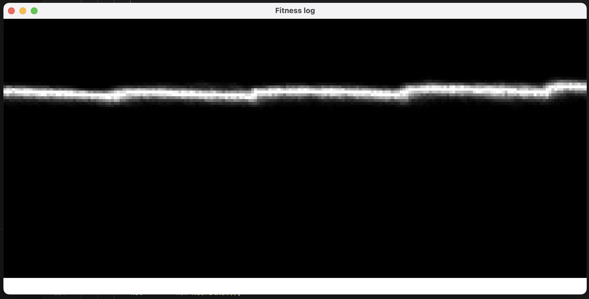
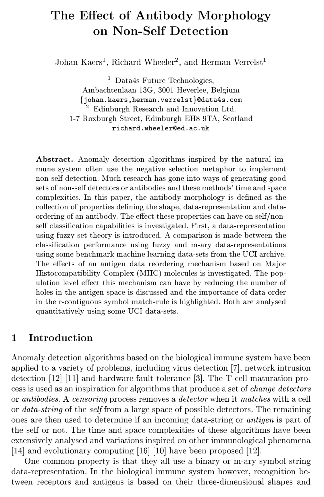
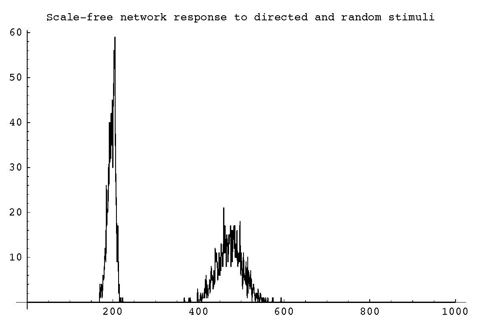
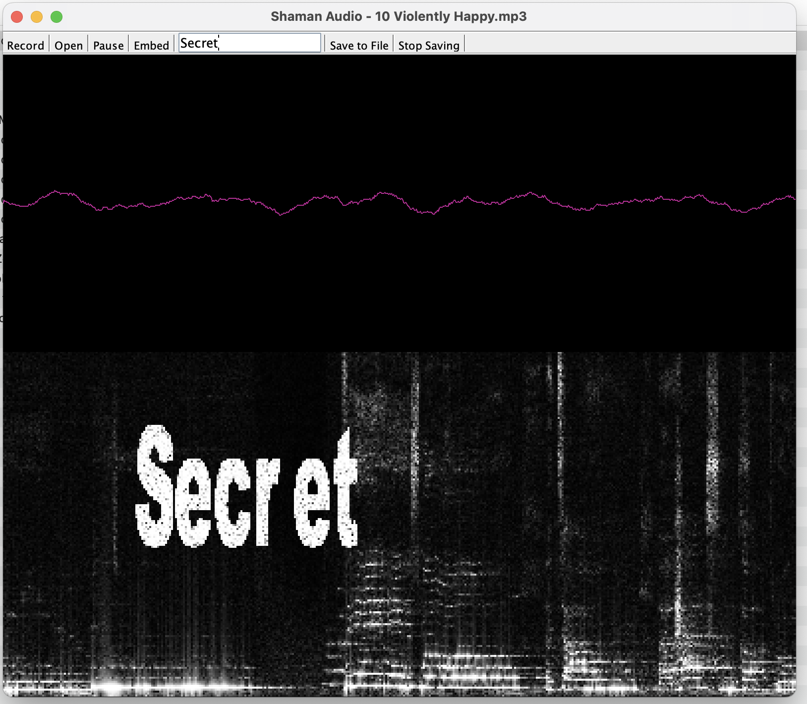

# Shaman
 

Shaman contains research into machine learning, robotics, complex network theory, evolutionary algorithms, media processing, and GPU programming. All components are built on the same data-flow architecture and integrated with eachother.
e.g. 
- Graph theory package is used to define the topology of the neural networks or artificial immune systems
- Simulated robots are controlled by a neural network
- Neural networks can be trained with backpropagation or through genetic algorithms

The source code supporting my own papers is included:
- [A Spatial EA Framework for Parallelizing Machine Learning Methods](https://link.springer.com/chapter/10.1007/978-3-642-32937-1_21)
- [The Effect of Antibody Morphology on Non-self Detection](http://dx.doi.org/10.1007/978-3-540-45192-1_27)
- Building a Robust Artificial Immune System

as well as implementations of: 
- [Response of complex networks to stimuli](https://doi.org/10.1073/pnas.0400673101) by Yaneer Bar-Yam and Irving R. Epstein
- [Evolving virtual creatures](https://doi.org/10.1145/192161.192167) by Karl Sims

## Core
The core components on which all machine learning, media processing and other algorithms are based.
- Data-flow framework
- Input / output of tabular datasets, audio- and video streams
- Preprocessing: PCA, Discretization, Normalization, Fuzzy sets

## Machine Learning
A collection machine learning algorithms.
- Classification Trees
- Random Forests
- Neural networks
  - Multi-layer perceptrons
  - Hopfield nets
  - Self-organizing maps
- Support Vector Machines
- Linear regression
- Case based reasoning
- Naive bayes
- K-Means clustering
- Text mining
- Model testing: Cross validation, model comparison

### Spatial Boosting
This method combines spatially-structured evolutionary algorithms with ensemble learning and boosting to parallelize machine learning methods and enhance their accuracy without requiring changes to the methods themselves.

[A Spatial EA Framework for Parallelizing Machine Learning Methods](https://link.springer.com/chapter/10.1007/978-3-642-32937-1_21)

 

## Evolutionary Algorithms
Implementation of the classic paper [Evolving virtual creatures](https://doi.org/10.1145/192161.192167)
- Simulated 3 dimensional figures controlled by a neural network
- Island model genetic algorithms
- Lightweight 3d physics engine ([jinngine](https://code.google.com/archive/p/jinngine/))

 
<!--  -->

## Artificial Immune Systems
Research into biologically inspired machine learning based on the immune system, resulting in the papers:
- [The Effect of Antibody Morphology on Non-self Detection](http://dx.doi.org/10.1007/978-3-540-45192-1_27)
- Building a Robust Artificial Immune System

The package contains
- Core Artificial Immune System (AIS) for anomaly detection
- Parallelization by embedding in a complex network topology
- Analysis of detection performance under network attack

 
<!--  -->

## Graph Theory
Graph theory / complex networks
- Graph topologies used by neural networks, genetic algorithms and artificial immune systes
- Scale-free, small-world networks
- Graph metrics

Implementation of [Response of complex networks to stimuli](https://doi.org/10.1073/pnas.0400673101)

<!--  -->

## GPU Programming
OpenCL based GPU programming (using [APARAPI](https://aparapi.com)) for
- Video stream processing
- Naive Bayes machine learning

 
<!--  -->

## Media Processing
Various media processing experiments
- Audio stream processing
- Speech recognition (Sphinx)
- Speech synthesis (FreeTTS)
- Video stream processing

 
<!--  -->
