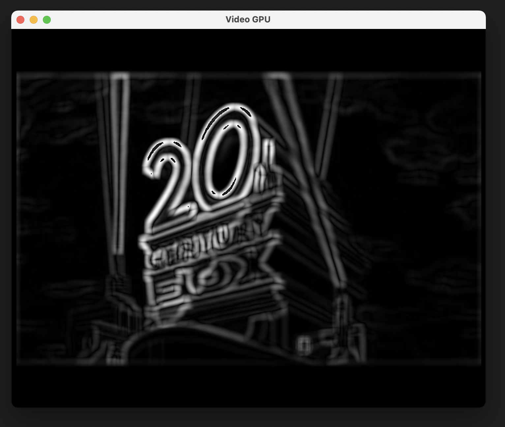

# Shaman
Research into machine learning, robotics, complex network theory, media processing, GPU programming and combinations thereof.

 

## Machine learning
- Boosting
- Random Forests
- Neural networks
  - Multi-layer perceptrons
  - Hopfield nets
  - Self-organizing map
- Support Vector Machines
- Linear regression
- Case based reasoning
- Naive bayes
- K-Means
- Text mining
- Preprocessing: PCA, Discretization, Normalization
- Testing: Cross validation, model comparison

 
<!--  -->

## Evolutionary algorithms
- Evolutionary robotics
- Island model genetic algorithms

 
 

<!--   -->

## Artificial immune systems
- Anomaly detection
- Fuzzy set theory
- Embedding in complex networks

 
<!--  -->

## Complex network theory
- Graph metrics
- Scale-free graphs

<!--  -->

## Media processing
- Audio processing
- Video processing

 
<!--  -->

## GPU programming
- OpenCL kernel for video processing
- OpenCL kernel for Naive Bayes

 
<!--  -->
